<p align="center">
The Set-boundary based Reachability Analysis Toolbox in Python
</p>


<p align="center">
    <br />
        <a href="https://asag-iscas.github.io/docs.pybdr/"><strong>Online Documents »</strong></a>
    <br />    
</p>

# Motivation

Reachability analysis, which involves computing reachable state sets, plays a fundamental role in the temporal
verification of nonlinear systems. Overly pessimistic over-approximations, however, render many temporal properties
unverifiable in practice. This pessimism mainly arises due to the wrapping effect, which is the propagation and
accumulation of over-approximation error through the iterative computation in the construction of reachable sets. As the
extent of the wrapping effect correlates strongly with the volume of the initial set, techniques that partition the
initial state space and independently compute reachable sets of those partitions are often used to reduce the wrapping
effect,

$${\color{red} \text{some colorized text}}$$

<span style="color:red">especially for large initial sets or/and large time horizons</span>.
Such partitioning may, however, induce extensive
demand on computation time and memory, often rendering the existing reachability analysis techniques not suitable for
complex real-world applications. Not being forced to explore the full, i.g. exponential in the dimensionality, number of
partitions could help such procedures tremendously. This is the theme of this tool, which implements the
so-called <a href="http://lcs.ios.ac.cn/~xuebai/publication.html"><strong>'set-boundary based method'</strong></a> that
explores means of computing
the full reachable state space based on state-exploratory analysis of just a small sub-volume of the initial state set,
namely a set enclosing its boundary. For theoretical analysis, please refer to
<a href="https://ieeexplore.ieee.org/document/7585104"><strong>'Bai Xue, Arvind Easwaran, Nam-Joon Cho and Martin
Fränzle.Reach-Avoid Verification for Nonlinear Systems Based on Boundary Analysis. IEEE Transactions on Automatic
Control (IEEE TAC), vol. 62: 3518--3523, 2017.'</strong></a> and
<a href="https://ieeexplore.ieee.org/document/9023360"><strong>'Bai Xue, Qiuye Wang, Shenghua Feng, and Naijun Zhan.
Over-and underapproximating reach sets for perturbed delay differential equations. IEEE Transactions on Automatic
Control (IEEE TAC), vol.66: 283--290,2020.'</strong></a>

$${\color{purple} \frak{ \color{orange}Rise \space \color{cyan}and \space \color{magenta}Rise \space
\color{lime}again \space \color{violet}until \space \color{lightgray}Lambs \space \color{teal}become \space
\color{red}Lions !} } $$

The set-boundary based method can be used to perform reachability analysis for systems modelled by

1. ordinary differential equations (subject to Lispchitz continuous perturbations)
2. delay differential equations (subject to Lispchitz continuous perturbations)
3. neural ordinary differential equations

# Installation

No need to do installation, just copy the source code into appropriate directory, like using some
Matlab third-party library. We highly recommend you to use `Pycharm` as an IDE for development and
testing.

## Virtual Environment

We recommend that users use miniconda to initialise a virtual environment for the subsequent
installation and running of third party libraries. The steps are as follows.

In the user's current working directory, the user can initialise a virtual test environment called
`pybdr_lab` using the following command.

```shell
conda create -n pybdr_lab
```

After the virtual environment has been initialized, the user activates the virtual test environment
named pybdr_lab that has just been initialized with the following command.

```shell
conda activate pybdr_lab
```

## Dependencies

Now, you can install the necessary third party libraries in this virtual environment using the
following series of commands.

```shell
conda install matplotlib
conda install -c conda-forge numpy
conda install -c conda-forge cvxpy
conda install scipy
conda install -c mosek mosek
pip install pypoman
conda install -c anaconda sympy
pip install open3d
```

For the reason we may use Mosek as a solver for optimisation, we highly recommend you to apply for
an official personal licence, the steps for which can be found
at [this link](https://docs.mosek.com/10.0/licensing/index.html).

# How to use

## Computing Reachable Sets based on Boundary Analysis for Nonlinear Systems

Sample files are provided to show how to use the tool to compute reachable sets. One can refer
to the sample files provided and modify the dynamics and parameters required for the computation to
see the effect of using different settings for doing reachability analysis.

For example, consider following dynamic system:

$$
\begin{align*}
\dot{x} &= y \\
\dot{y} &= (1-x^2)y-x
\end{align*}
$$

```python
import numpy as np

from pyrat.algorithm import ASB2008CDC
from pyrat.dynamic_system import NonLinSys
from pyrat.geometry import Zonotope, Interval, Geometry
from pyrat.geometry.operation import boundary
from pyrat.model import *
from pyrat.util.visualization import plot

# init dynamic system
system = NonLinSys(Model(vanderpol, [2, 1]))

# settings for the computation
options = ASB2008CDC.Options()
options.t_end = 6.74
options.step = 0.005
options.tensor_order = 3
options.taylor_terms = 4
options.u = Zonotope.zero(1, 1)
options.u_trans = np.zeros(1)

z = Zonotope([1.4, 2.4], np.diag([0.17, 0.06]))

# -----------------------------------------------------
# computing reachable sets with boundary analysis
options.r0 = boundary(z, 1, Geometry.TYPE.ZONOTOPE)
# -----------------------------------------------------
# computing reachable sets without boundary analysis
# options.r0 = [z]
# -----------------------------------------------------

# settings for the using geometry
Zonotope.REDUCE_METHOD = Zonotope.REDUCE_METHOD.GIRARD
Zonotope.ORDER = 50

# reachable sets computation
ti, tp, _, _ = ASB2008CDC.reach(system, options)

# visualize the results
plot(tp, [0, 1])
```

|     With Boundary Analysis (BA)     |       No Boundary Analysis (NBA)       |
|:-----------------------------------:|:--------------------------------------:|
| 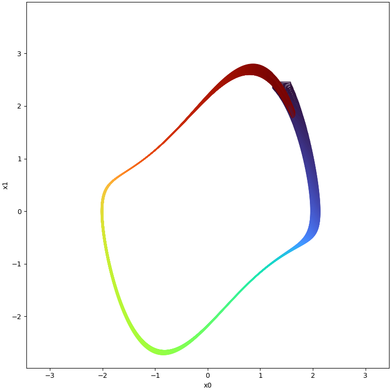 | 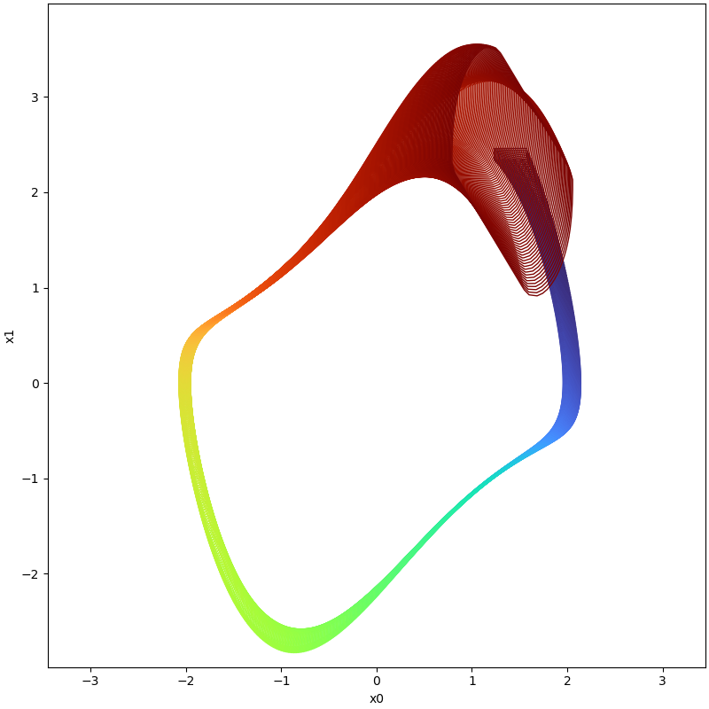 |

For large initial sets,

|                                                         System                                                          |                                                                 Code                                                                 |   Reachable Sets (Orange-NBA,Blue-BA)   |
|:-----------------------------------------------------------------------------------------------------------------------:|:------------------------------------------------------------------------------------------------------------------------------------:|:---------------------------------------:|
|        [synchronous machine](https://github.com/ASAG-ISCAS/PyBDR/blob/master/pyrat/model/synchronous_machine.py)        | [benchmark_synchronous_machine_cmp.py](https://github.com/ASAG-ISCAS/PyBDR/blob/master/example/benchmark_synchronous_machine_cmp.py) |   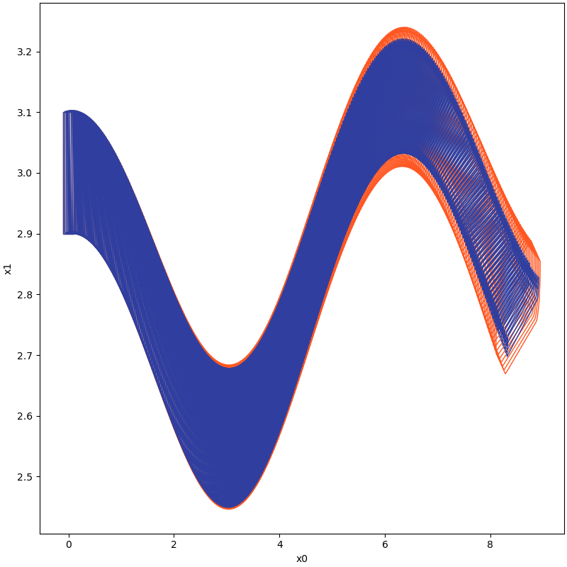    |
| [Lotka Volterra model of 2 variables](https://github.com/ASAG-ISCAS/PyBDR/blob/master/pyrat/model/lotka_volterra_2d.py) |   [benchmark_lotka_volterra_2d_cmp.py](https://github.com/ASAG-ISCAS/PyBDR/blob/master/example/benchmark_lotka_volterra_2d_cmp.py)   | 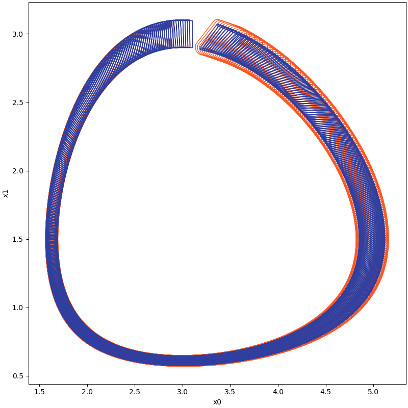 |
|                 [Jet engine](https://github.com/ASAG-ISCAS/PyBDR/blob/master/pyrat/model/jet_engine.py)                 |          [benchmark_jet_engine_cmp.py](https://github.com/ASAG-ISCAS/PyBDR/blob/master/example/benchmark_jet_engine_cmp.py)          |    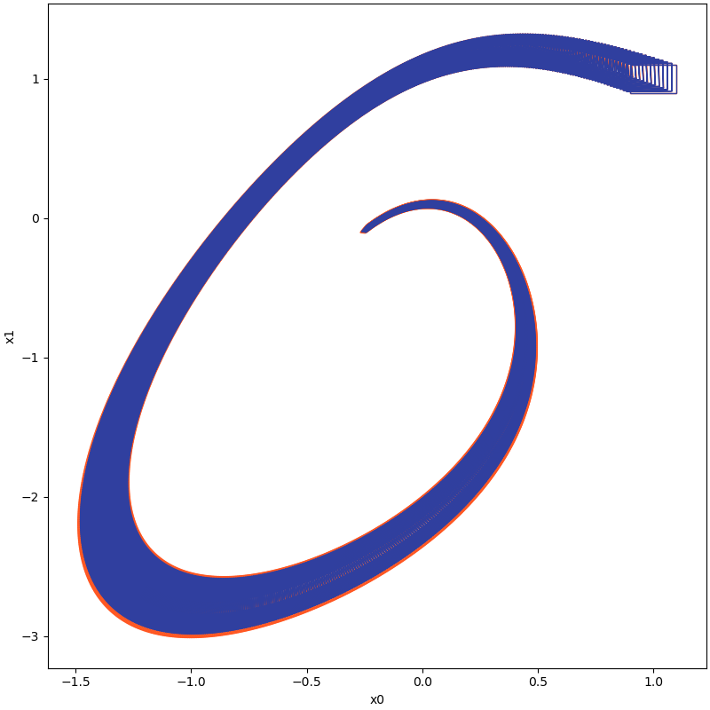     |

For large time horizons, i.e. consider
the system [Brusselator](https://github.com/ASAG-ISCAS/PyBDR/blob/master/pyrat/model/brusselator.py)
> For more details about the following example, please refer to
> our [code](https://github.com/ASAG-ISCAS/PyBDR/blob/master/example/benchmark_brusselator_cmp.py).

| Time instance | With Boundary Analysis                |        Without Boundary Analysi         |
|:-------------:|---------------------------------------|:---------------------------------------:|
|    t=5.4s     | 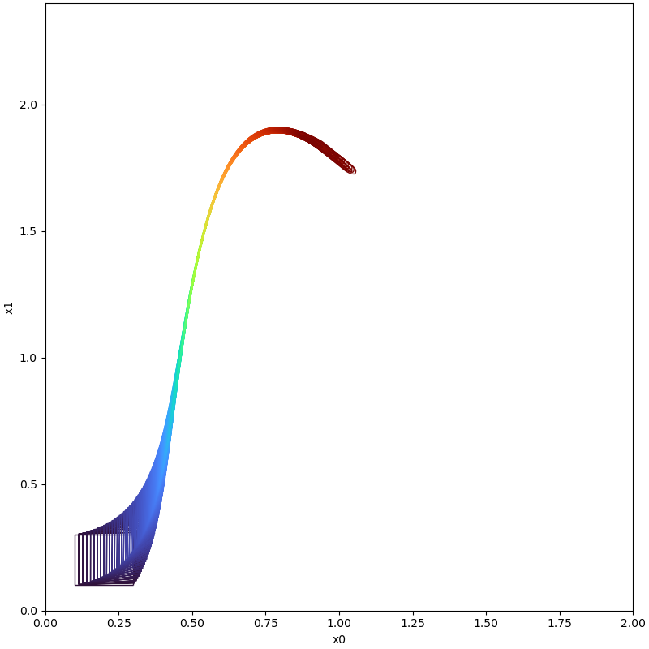 | 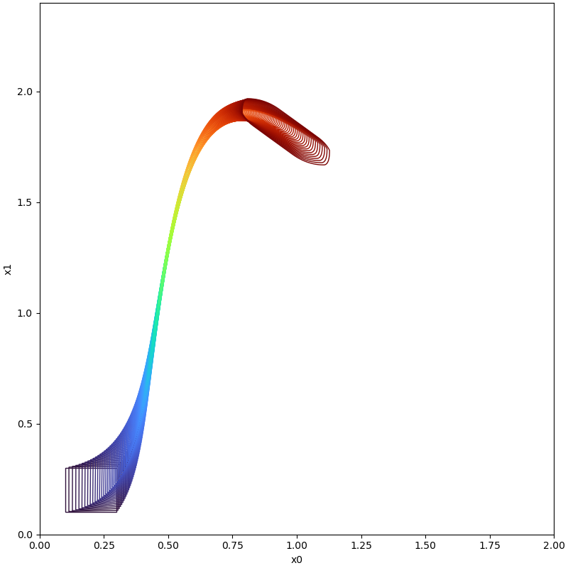' |
|    t=5.7s     | 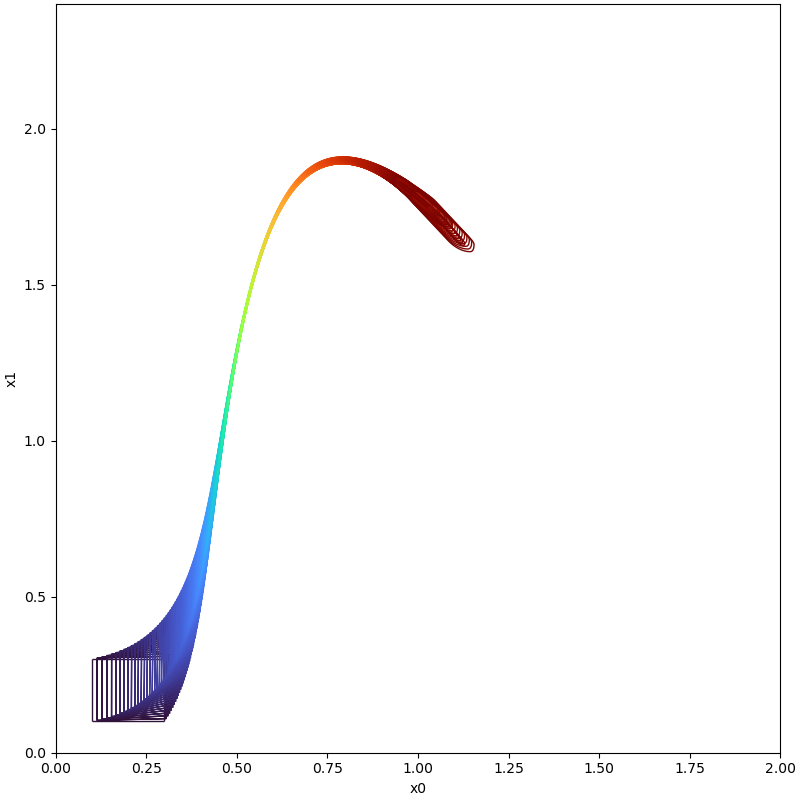 | 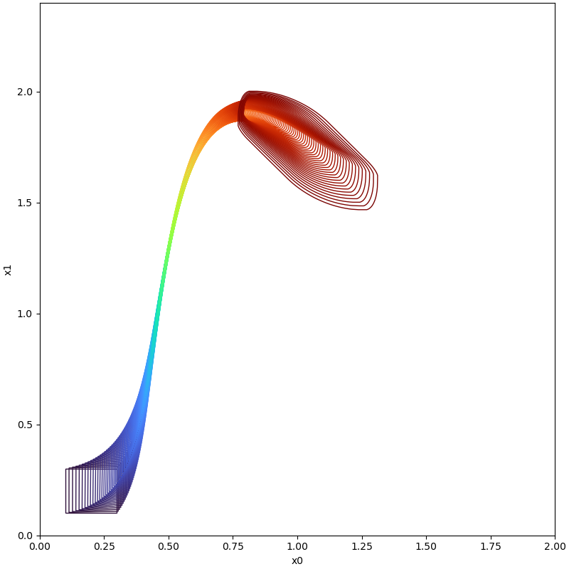  |
|    t=6.0s     | 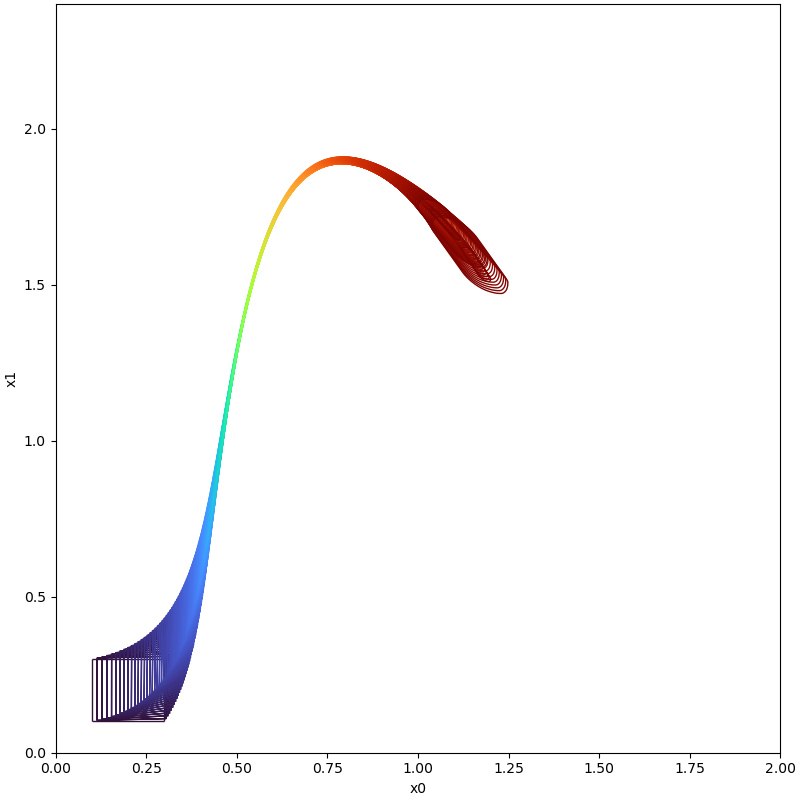   |  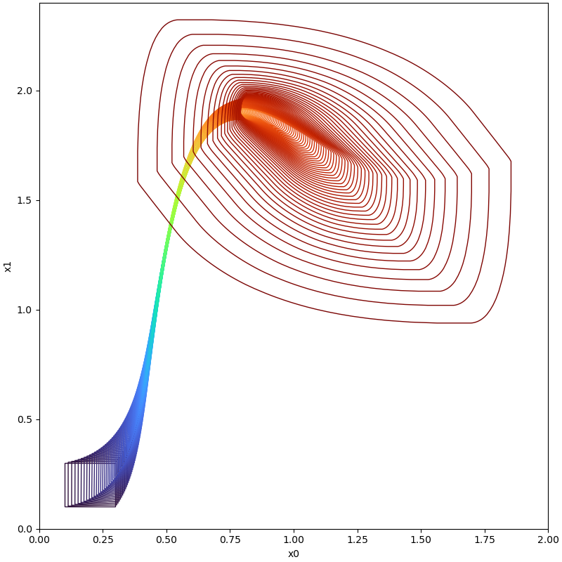   |
|    t=6.1s     | 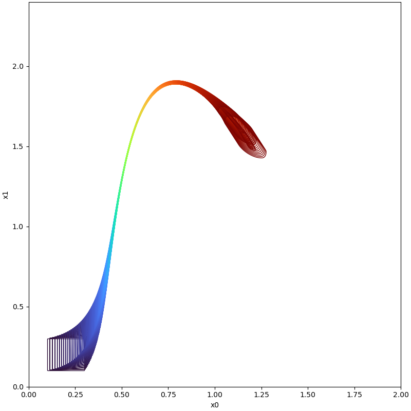 |       __Set Explosion Occurred!__       |

## Computing Reachable Sets based on Boundary Analysis for Neural ODE

For example, consider a neural ODE with following parameters and $\textit{sigmoid}$ activation function, also evaluated
in <a href="https://link.springer.com/content/pdf/10.1007/978-3-031-15839-1_15.pdf"><strong>'Manzanas Lopez, D., Musau,
P., Hamilton, N. P., & Johnson, T. T. Reachability analysis of a general class of neural ordinary differential
equations. In Formal Modeling and Analysis of Timed Systems: 20th International Conference, FORMATS 2022, Warsaw,
Poland, September 13–15, 2022, Proceedings (pp. 258-277).'</strong></a>:

$$
w_1 = \left[
\begin{align*}
0.2911133 \quad & 0.12008807\\
-0.24582624 \quad & 0.23181419\\
-0.25797904 \quad & 0.21687193\\
-0.19282854 \quad & -0.2602416 \\
0.26780415 \quad & -0.20697702\\
0.23462369\quad & 0.2294843 \\
-0.2583547\quad & 0.21444395\\
-0.04514714 \quad & 0.29514763\\
-0.15318371 \quad & -0.275755 \\
0.24873598 \quad & 0.21018365
\end{align*}
\right]        
$$

$$
w_2 = \left[
\begin{align*}
-0.58693904 \quad & -0.814841 & -0.8175157 \quad & 0.97060364 & 0.6908913\\
-0.92446184 \quad & -0.79249185 & -1.1507587 \quad & 1.2072723 & -0.7983982\\
1.1564877 \quad & -0.8991244 & -1.0774536 \quad & -0.6731967 & 1.0154784\\
0.8984464 \quad & -1.0766245 & -0.238209 \quad & -0.5233613 & 0.8886671
\end{align*}
\right]
$$

$$
b_1 = \left[
\begin{align*}
0.0038677\quad & -0.00026365 & -0.007168970\quad & 0.02469357 & 0.01338706\\
0.00856025\quad & -0.00888401& 0.00516089\quad & -0.00634514 & -0.01914518
\end{align*}
\right]
$$

$$
b_2 = \left[
\begin{align*}
-0.04129209 \quad & -0.01508532
\end{align*}
\right]
$$

```python
import numpy as np

np.seterr(divide='ignore', invalid='ignore')
import sys

# sys.path.append("./../../") uncomment this line if you need to add path manually
from pyrat.algorithm import ASB2008CDC
from pyrat.dynamic_system import NonLinSys
from pyrat.geometry import Zonotope, Interval, Geometry
from pyrat.model import *
from pyrat.util.visualization import plot
from pyrat.util.functional.neural_ode_generate import neuralODE
from pyrat.geometry.operation import boundary

# init neural ODE
system = NonLinSys(Model(neuralODE, [2, 1]))

# settings for the computation
options = ASB2008CDC.Options()
options.t_end = 1.5
options.step = 0.01
options.tensor_order = 2
options.taylor_terms = 2
Z = Zonotope([0.5, 0], np.diag([1, 0.5]))

# Reachable sets computed with boundary analysis
# options.r0 = boundary(Z,1,Geometry.TYPE.ZONOTOPE)

# Reachable sets computed without boundary analysis
options.r0 = [Z]

options.u = Zonotope.zero(1, 1)
options.u_trans = np.zeros(1)

# settings for the using geometry
Zonotope.REDUCE_METHOD = Zonotope.REDUCE_METHOD.GIRARD
Zonotope.ORDER = 50

# reachable sets computation
ti, tp, _, _ = ASB2008CDC.reach(system, options)

# visualize the results
plot(tp, [0, 1])
```

In the following table, we show the reachable computed with boundary analysis and without boundary analysis on different
time instance cases.

| Time Instance |    With Boundary Analysis     |  Without Boundary Analysis   |
|:-------------:|:-----------------------------:|:----------------------------:|
|    t=0.5s     | 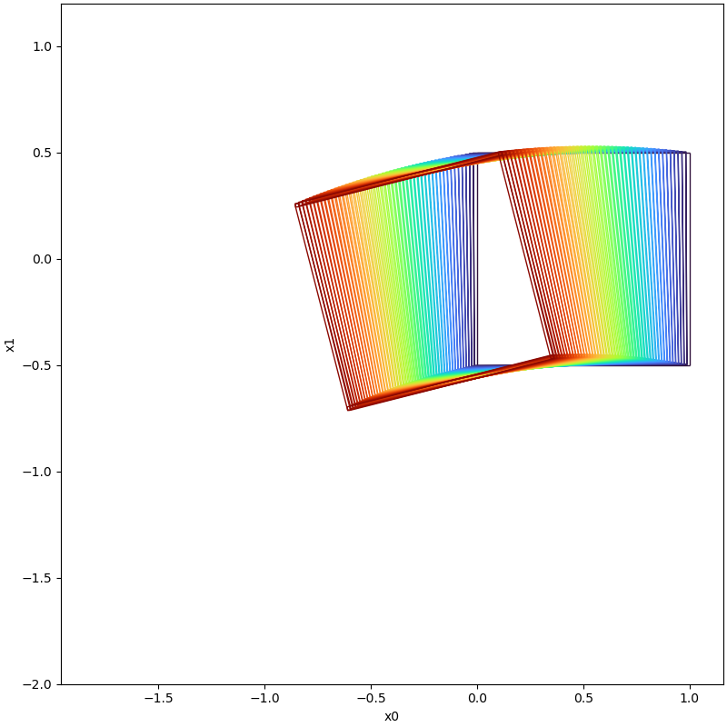 | 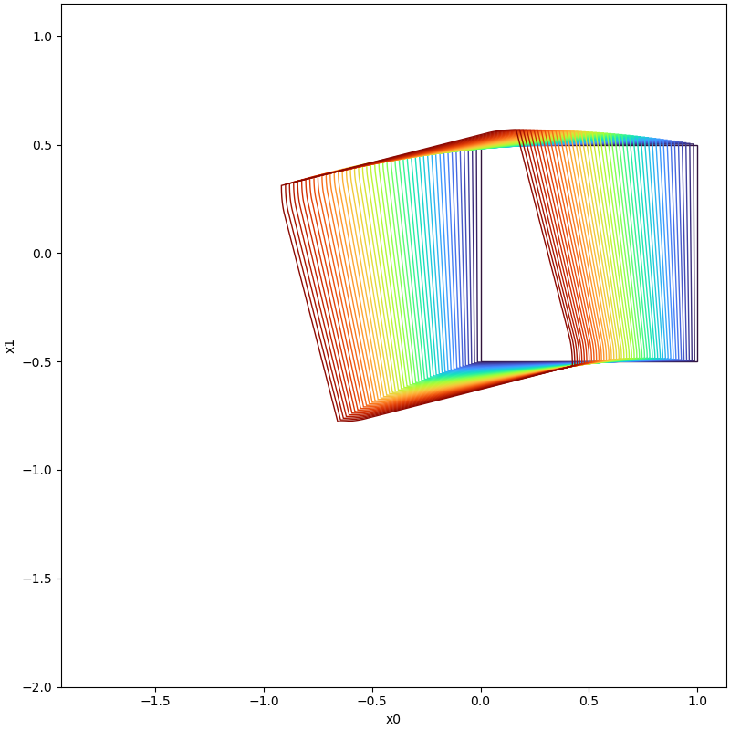 |
|    t=1.0s     | 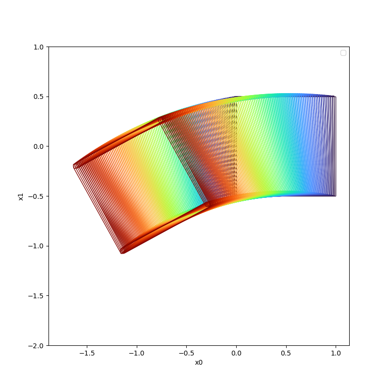  | 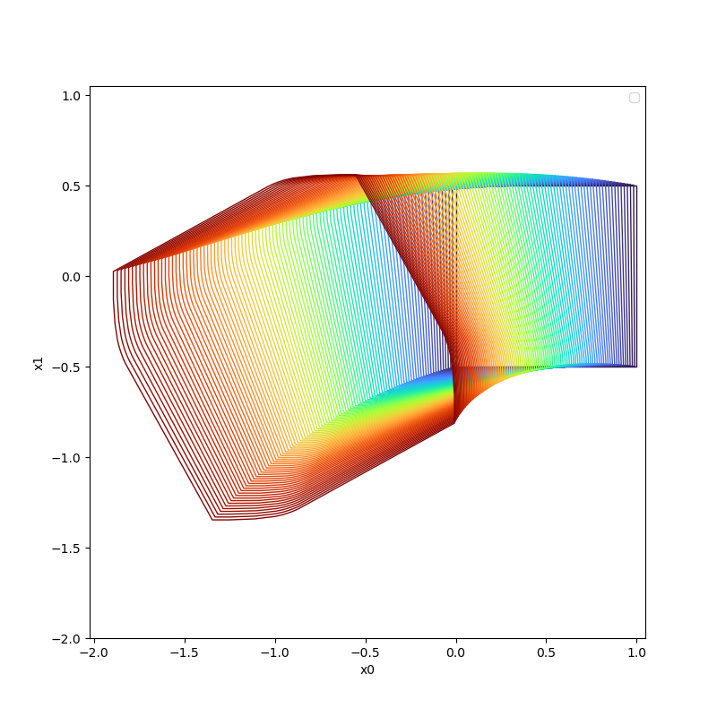  |
|    t=1.5s     | 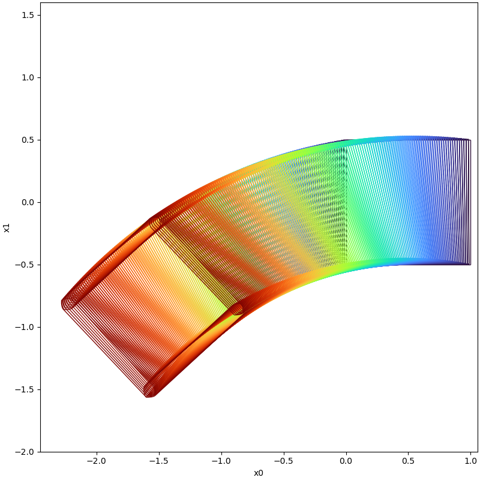 |  __Set Explosion Occured!__  |

## Frequently Asked Questions and Troubleshooting

### The computation is slow

- The tool supports two modes of computation for reachable sets, one is to compute the reachable set
  of evolved states
  based on the entire initial set in a set propagation manner, and the other is to compute the
  reachable set of
  evolved states based on the boundary of the initial state set.

  There are several reasons for slow computations: large computational time intervals,
  small step,
  high Taylor expansion orders, and a large number of state variables.

  In order to speed up the computations, experiments can be carried out using a smaller computational time
  horizon, a smaller order of
  expansion such as 2, and a larger time step, and then gradually increase the computational time
  horizon and the order
  of expansion according to the results of this setting, in order to obtain the desired set of
  reachable states at a
  suitable time consumption.

### Controlling the wrapping effect

<!--  Due to the wrapping effect of set propagation based algorithms, 
it is inevitable that the range of
  the computed
  reachable state sets is too conservative under inappropriate settings, making it impossible to
  obtain a reachable
  state set that meets the requirements.  If these problems occur, -->

- One can further improve the accuracy of the reachable set calculation based on splitting boundaries of initial sets,
  or by reducing the step and
  increasing the
  order of the Taylor expansion.

  <!--then the set explosion problem can be avoided in the computation
  possibly.-->

### RuntimeWarning: divide by zero encountered in true_divide

- This warning may be reported on the paltforms with Windows operating system. It does not affect the running of the
  tool and it can be eliminiated with the decalration:

  ```python
  numpy.seterr(divide='ignore', invalid='ignore')
  ```

> Feel free to contact [dingjianqiang0x@gmail.com](mailto:dingjianqiang0x@gmail.com) if you find any
> issues or bugs in this code, or you struggle to run it in any way.

## License

This project is licensed under the GNU GPLv3 License - see the [LICENSE](LICENSE.md) file for
details.

## Acknowledgement

This tool has been developed with reference to models in tools such as Flow*, CORA and other
reachable set computing tools.
