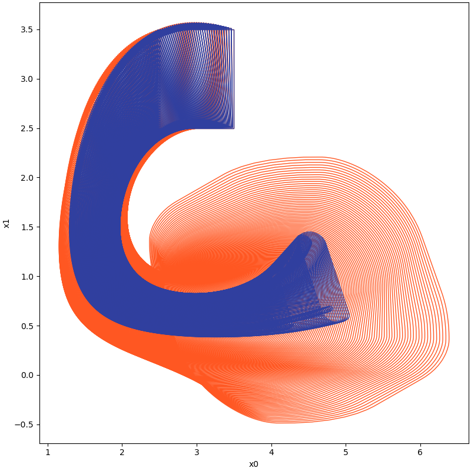
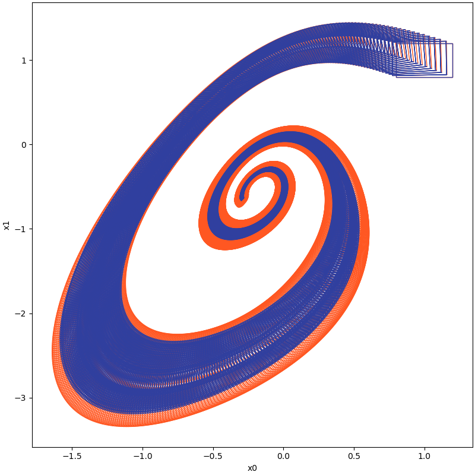

<p align="center">
Set-boundary based Reachability Analysis Toolbox in Python
</p>


<p align="center">
    <br />
        <a href="https://asag-iscas.github.io/docs.pybdr/"><strong>Online Documents »</strong></a>
    <br />    
</p>

# Motivation

Reachability analysis, which involves computing reachable state sets, plays a fundamental role in the temporal
verification of nonlinear systems. Overly pessimistic over-approximations, however, render many temporal properties
unverifiable in practice. This pessimism mainly arises due to the wrapping effect, which is the propagation and
accumulation of over-approximation error through the iterative computation in the construction of reachable sets. As the
extent of the wrapping effect correlates strongly with the volume of the initial set, techniques that partition the
initial state space and independently compute reachable sets of those partitions are often used to reduce the wrapping
effect, <a href="https://ieeexplore.ieee.org/document/7585104"><strong>especially for large initial sets or/and large
time horizons</strong></a>.
Such partitioning may, however, induce extensive demand on computation time and memory, often rendering the existing
reachability analysis techniques not suitable for
complex real-world applications. Not being forced to explore the full, i.g. exponential in the dimensionality, number of
partitions could help such procedures tremendously. This is the theme of this tool, which implements the
so-called <a href="http://lcs.ios.ac.cn/~xuebai/publication.html"><strong>'set-boundary based method'</strong></a> that
explores means of computing
the full reachable state space based on state-exploratory analysis of just a small sub-volume of the initial state set,
namely a set enclosing its boundary. For theoretical analysis, please refer to
<a href="https://ieeexplore.ieee.org/document/7585104"><strong>'Bai Xue, Arvind Easwaran, Nam-Joon Cho and Martin
Fränzle.Reach-Avoid Verification for Nonlinear Systems Based on Boundary Analysis. IEEE Transactions on Automatic
Control (IEEE TAC), vol. 62: 3518--3523, 2017.'</strong></a> and
<a href="https://ieeexplore.ieee.org/document/9023360"><strong>'Bai Xue, Qiuye Wang, Shenghua Feng, and Naijun Zhan.
Over-and underapproximating reach sets for perturbed delay differential equations. IEEE Transactions on Automatic
Control (IEEE TAC), vol.66: 283--290,2020.'</strong></a>

The set-boundary based method can be used to perform reachability analysis for systems modelled by

1. ordinary differential equations (subject to Lispchitz continuous perturbations)
2. delay differential equations (subject to Lispchitz continuous perturbations)
3. neural ordinary differential equations

# Installation
The installation process is deemed unnecessary as it only involves copying the source code to the proper directory, much like how a third-party library in MATLAB functions. We highly recommend developers to utilize Pycharm as the integrated development environment (IDE) for their development and testing needs. Pycharm offers a range of advanced features that greatly aid in testing, debugging, and code analysis.
<!--The installation process is unnecessary as the source code needs to be copied into the appropriate directory, similar to
how a third-party library in MATLAB works. We strongly recommend developers to utilize `Pycharm` as the IDE for
development and testing purposes. By using `Pycharm`, developers can benefit from various advanced features that
facilitate testing, debugging, and code analysis.-->

## Virtual Environment

<!--The installation process is unnecessary as the source code needs to be copied into the appropriate directory, similar to
how a third-party library in MATLAB works. We strongly recommend developers to utilize `Pycharm` as the IDE for
development and testing purposes. By using `Pycharm`, developers can benefit from various advanced features that
facilitate testing, debugging, and code analysis.

### Virtual Environment-->

To ensure a smoother installation and running of third-party libraries, we advise users to
use [miniconda](https://docs.conda.io/en/latest/miniconda.html) and create a virtual environment. The steps for this
process are as follows:

First, open the user's current working directory, and use the command

```shell
conda create -n pybdr_lab
```

to initialize a virtual test environment called "pybdr_lab".

After the virtual environment has been created, the user needs to activate it before running any third-party libraries.
This can be done using the command

```shell
conda activate pybdr_lab
```

By activating the virtual environment, the user ensures that any package installations and other commands will run
within the virtual environment, rather than the system environment.

## Dependencies

Now, the user can install the necessary third party libraries in this virtual environment using the following commands.

```shell
conda install matplotlib
conda install -c conda-forge numpy
conda install -c conda-forge cvxpy
conda install scipy
conda install -c mosek mosek
pip install pypoman
conda install -c anaconda sympy
pip install open3d
```

For the reason we may use Mosek as a solver for optimisation, we highly recommend you to apply for
an official personal licence, the steps for which can be found
at [this link](https://docs.mosek.com/10.0/licensing/index.html).

# How to use [](https://colab.research.google.com/drive/1H2PWSAgAzesNnbEFXo6Ii1HGEip9WHOY?usp=sharing)

## Computing Reachable Sets based on Boundary Analysis for Nonlinear Systems

The tool provides sample files which serve as demonstrations of the proper utilization for computing reachable sets. These sample files serve as a reference point for users to grasp the process of modifying the dynamics and parameters necessary for reachability analysis. This feature aids users in experimenting with their analyses, allowing them to assess the impact of different settings on the overall computation of the reachable sets

<!--The tool comes with sample files that demonstrate how it should be utilized to compute reachable sets. By referring to
these sample files, users can gain an understanding of how to modify the dynamics and parameters required for
reachability analysis. This feature helps users experiment with their analysis by using different settings to assess
their effects on the overall computation of the reachable sets.-->

For example, consider the following dynamic system:

$$
\begin{align*}
\dot{x} &= y \\
\dot{y} &= (1-x^2)y-x
\end{align*}
$$

```python
import numpy as np
from pybdr.algorithm import ASB2008CDC, ASB2008CDC
from pybdr.util.functional import performance_counter, performance_counter_start
from pybdr.geometry import Zonotope, Interval, Geometry
from pybdr.geometry.operation import boundary, cvt2
from pybdr.model import *
from pybdr.util.visualization import plot

# settings for the computation
options = ASB2008CDC.Options()
options.t_end = 6.74
options.step = 0.005
options.tensor_order = 3
options.taylor_terms = 4
options.u = Zonotope.zero(1, 1)
options.u_trans = np.zeros(1)

# settings for the using geometry
Zonotope.REDUCE_METHOD = Zonotope.REDUCE_METHOD.GIRARD
Zonotope.ORDER = 50

z = Interval([1.23, 2.34], [1.57, 2.46])
x0 = cvt2(z, Geometry.TYPE.ZONOTOPE)
xs = boundary(z, 1, Geometry.TYPE.ZONOTOPE)

this_time = performance_counter_start()
ri_without_bound, rp_without_bound = ASB2008CDC.reach(vanderpol, [2, 1], options, x0)
this_time = performance_counter(this_time, 'reach_without_bound')

ri_with_bound, rp_with_bound = ASB2008CDC.reach_parallel(vanderpol, [2, 1], options, xs)
this_time = performance_counter(this_time, 'reach_with_bound')

# visualize the results
plot(ri_without_bound, [0, 1])
plot(ri_with_bound, [0, 1])
```

|     With Boundary Analysis (BA)     |       No Boundary Analysis (NBA)       |
|:-----------------------------------:|:--------------------------------------:|
|  |  |

For large initial sets,

|                                                         System                                                          |                                                                  Code                                                                   |   Reachable Sets (Orange-NBA,Blue-BA)   |
|:-----------------------------------------------------------------------------------------------------------------------:|:---------------------------------------------------------------------------------------------------------------------------------------:|:---------------------------------------:|
|        [synchronous machine](https://github.com/ASAG-ISCAS/PyBDR/blob/master/pybdr/model/synchronous_machine.py)        | [benchmark_synchronous_machine_cmp.py](https://github.com/ASAG-ISCAS/PyBDR/blob/master/benchmarks/benchmark_synchronous_machine_cmp.py) |       |
| [Lotka Volterra model of 2 variables](https://github.com/ASAG-ISCAS/PyBDR/blob/master/pybdr/model/lotka_volterra_2d.py) |   [benchmark_lotka_volterra_2d_cmp.py](https://github.com/ASAG-ISCAS/PyBDR/blob/master/benchmarks/benchmark_lotka_volterra_2d_cmp.py)   |  |
|                 [Jet engine](https://github.com/ASAG-ISCAS/PyBDR/blob/master/pybdr/model/jet_engine.py)                 |          [benchmark_jet_engine_cmp.py](https://github.com/ASAG-ISCAS/PyBDR/blob/master/benchmarks/benchmark_jet_engine_cmp.py)          |         |

For large time horizons, i.e. consider
the system [Brusselator](https://github.com/ASAG-ISCAS/PyBDR/blob/master/pybdr/model/brusselator.py)
> For more details about the following example, please refer to
> our [code](https://github.com/ASAG-ISCAS/PyBDR/blob/master/benchmarks/benchmark_brusselator_cmp.py).

| Time instance | With Boundary Analysis                |        Without Boundary Analysi        |
|:-------------:|---------------------------------------|:--------------------------------------:|
|     t=5.4     |  |  |
|     t=5.7     |  |  |
|     t=6.0     |    |    |
|     t=6.1     |  |      __Set Explosion Occurred!__       |

## Computing Reachable Sets based on Boundary Analysis for Neural ODE

For example, consider a neural ODE with the following parameters and $\textit{sigmoid}$ activation function, also
evaluated
in <a href="https://link.springer.com/content/pdf/10.1007/978-3-031-15839-1_15.pdf"><strong>'Manzanas Lopez, D., Musau,
P., Hamilton, N. P., & Johnson, T. T. Reachability analysis of a general class of neural ordinary differential
equations. In Formal Modeling and Analysis of Timed Systems: 20th International Conference, FORMATS 2022, Warsaw,
Poland, September 13–15, 2022, Proceedings (pp. 258-277).'</strong></a>:

$$
w_1 = \left[
\begin{align*}
0.2911133 \quad & 0.12008807\\
-0.24582624 \quad & 0.23181419\\
-0.25797904 \quad & 0.21687193\\
-0.19282854 \quad & -0.2602416 \\
0.26780415 \quad & -0.20697702\\
0.23462369\quad & 0.2294843 \\
-0.2583547\quad & 0.21444395\\
-0.04514714 \quad & 0.29514763\\
-0.15318371 \quad & -0.275755 \\
0.24873598 \quad & 0.21018365
\end{align*}
\right]        
$$

$$
w_2 = \left[
\begin{align*}
-0.58693904 \quad & -0.814841 & -0.8175157 \quad & 0.97060364 & 0.6908913\\
-0.92446184 \quad & -0.79249185 & -1.1507587 \quad & 1.2072723 & -0.7983982\\
1.1564877 \quad & -0.8991244 & -1.0774536 \quad & -0.6731967 & 1.0154784\\
0.8984464 \quad & -1.0766245 & -0.238209 \quad & -0.5233613 & 0.8886671
\end{align*}
\right]
$$

$$
b_1 = \left[
\begin{align*}
0.0038677\quad & -0.00026365 & -0.007168970\quad & 0.02469357 & 0.01338706\\
0.00856025\quad & -0.00888401& 0.00516089\quad & -0.00634514 & -0.01914518
\end{align*}
\right]
$$

$$
b_2 = \left[
\begin{align*}
-0.04129209 \quad & -0.01508532
\end{align*}
\right]
$$

```python
import numpy as np

from pybdr.algorithm import ASB2008CDC
from pybdr.geometry import Zonotope, Interval, Geometry
from pybdr.model import *
from pybdr.util.visualization import plot, plot_cmp
from pybdr.geometry.operation import boundary, cvt2
from pybdr.util.functional import performance_counter_start, performance_counter

# settings for the computation
options = ASB2008CDC.Options()
options.t_end = 1
options.step = 0.01
options.tensor_order = 2
options.taylor_terms = 2

options.u = Zonotope([0], np.diag([0]))
options.u_trans = options.u.c

# settings for the using geometry
Zonotope.REDUCE_METHOD = Zonotope.REDUCE_METHOD.GIRARD
Zonotope.ORDER = 50

z = Interval([0, -0.5], [1, 0.5])
x0 = cvt2(z, Geometry.TYPE.ZONOTOPE)
xs = boundary(z, 2, Geometry.TYPE.ZONOTOPE)

print(len(xs))

this_time = performance_counter_start()
ri_without_bound, rp_without_bound = ASB2008CDC.reach(neural_ode_spiral1, [2, 1], options, x0)
this_time = performance_counter(this_time, "reach_without_bound")

ri_with_bound, rp_with_bound = ASB2008CDC.reach_parallel(neural_ode_spiral1, [2, 1], options, xs)
this_time = performance_counter(this_time, "reach_with_bound")

# visualize the results
plot_cmp([ri_without_bound, ri_with_bound], [0, 1], cs=["#FF5722", "#303F9F"])
```

In the following table, we show the reachable computed with boundary analysis and without boundary analysis on different
time instance cases.

| Time Instance |    With Boundary Analysis     |  Without Boundary Analysis   |
|:-------------:|:-----------------------------:|:----------------------------:|
|     t=0.5     |  |  |
|     t=1.0     |   |   |
|     t=1.5     |  |  __Set Explosion Occured!__  |

## Frequently Asked Questions and Troubleshooting

### The computation is slow

Two modes of computation are supported by the tool for reachable sets. One mode is to compute the reachable set of evolved states using the entire initial set in a set propagation manner, while the other mode is to compute the reachable set of evolved states based on the boundary of the initial state set.

The computation may be slow for several reasons such as large computational time intervals, small steps, high Taylor expansion orders, or a large number of state variables.

To accelerate the computations, experiments can be performed with a smaller computational time horizon, a smaller order of expansion (such as 2), and a larger time step. Then gradually increase the computational time horizon and order of expansion based on the results of this setting to achieve the desired set of reachable states at an acceptable time consumption.

<!--Two modes of computation are supported by the tool for reachable sets. One mode is to compute the reachable set of
evolved states using the entire initial set in a set propagation manner, while the other mode is to compute the
reachable set of evolved states based on the boundary of the initial state set.

The computation may be slow for several reasons such as large computational time intervals, small steps, high Taylor
expansion orders, or a large number of state variables.

To accelerate the computations, experiments can be performed with a smaller computational time horizon, a smaller
order
of expansion (such as 2), and a larger time step. Then gradually increase the computational time horizon and order of
expansion based on the results of this setting to achieve the desired set of reachable states at an acceptable time
consumption.-->

### Controlling the wrapping effect

To enhance the precision of the reachable set computation, one can split the boundaries of initial sets or increase the
order of the Taylor expansion while reducing the step size.

> Feel free to contact [dingjianqiang0x@gmail.com](mailto:dingjianqiang0x@gmail.com) if you find any
> issues or bugs in this code, or you struggle to run it in any way.

## License

This project is licensed under the GNU GPLv3 License - see the [LICENSE](LICENSE.md) file for
details.

## Acknowledgement

When developing this tool, we drew upon models used in other tools for calculating reachable sets, including Flow*, CORA, and various others.

<!--When creating this tool, reference was made to models utilized in other reachable set calculation tools such as Flow*,
CORA, and others.-->
